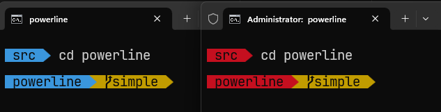

# Update



* Removed full path
* Improved speed for elevated mode detection and git branch
* Migrated to font "JetBrains Mono" 
* Changed folder background color to cyan


Assuming you put repo in folder ```c:\src\powerline\init.bat``` you can setup it like that:

### Windows Terminal

Find "Command Prompt" profile and change "Command line" setting to this: ```%SystemRoot%\System32\cmd.exe /k "c:\src\powerline\init.bat"```

### VSCode

. Press: Ctrl + Shift + P
. Type: Open User Settings (JSON)
. Add following lines:

```json
{
    ...
    // Only this settings matters in fact
    "terminal.integrated.profiles.windows": {
        "Command Prompt": {
            "path": [
                "${env:windir}\\Sysnative\\cmd.exe",
                "${env:windir}\\System32\\cmd.exe"
            ],
            "args": [
                "/K",
                "C:\\src\\powerline\\init.bat"        
            ],
        },
    },
    // But here are some bonus settings
    "terminal.integrated.fontFamily": "JetBrains Mono",
    "terminal.integrated.enablePersistentSessions": false,
    "terminal.integrated.cursorBlinking": true,
    "terminal.integrated.gpuAcceleration": "on",
    "terminal.integrated.defaultProfile.windows": "Command Prompt",
    ...
}
```
### Font

"JetBrains Mono" - For the moment you can download latest version from here: https://www.jetbrains.com/lp/mono/

### Notes

If you still want full path, uncomment this line in ```_set.bat```

```batch
        @REM set "PARENT_FOLDER=%CD%"
```

(Uncommenting in batch files means removing ```@REM```)

# Intro (For older version)

Ever wondered why you dont have something like this in Windows cmd.exe command prompt? (While they have it on mac and linux)


I had it in mind sometimes until I pushed on a wrong branch. After researching in the toilet it became obvious that it is totally doable using ```prompt``` the command:

Here is powerline in Windows Terminal Preview running cmd.exe


And this is Sublime Text running Terminus terminal running cmd.exe


# Prerequesites

To have it you will need:

1. Windows Terminal Preview from Microsoft Store https://www.microsoft.com/en-us/p/windows-terminal-preview/9n0dx20hk701
2. A font containing powerline symbols in my case 'Cascadia Code PL' from Microsoft github repo https://github.com/microsoft/cascadia-code/releases


In case of Sublime Text:
1. Terminal module Terminus for Sublime Text https://packagecontrol.io/packages/Terminus
2. And I do not remember for sure if this package also helped for displaying colors https://packagecontrol.io/packages/ANSIescape in Terminus


# Setup


Clone repo in some local folder. Let us assume path is ```d:\path\to\powerline```

## Windows Terminal Preview Setup
Basically our goal is to start init.bat after cmd.exe is lounched. i.e. to run ```cmd.exe /k d:\\path\\to\\powerline\\init.bat``` In case of windows terminal we can configure profile like this:
```json
{
    ...
    "commandline" : "cmd.exe /k d:\\path\\to\\powerline\\init.bat",
    "fontFace" : "Cascadia Code PL",
    ....
},
```

# Sublime Text Setup

This is ```Terminus.sublime-settings``` file

```json
{
    "256color": true,
    "theme": "campbell",
    "user_theme_colors":
    {
        "background": "#0c0c0c",
        "block_caret": "white",
        "caret": "white",
        "foreground": "#cccccc",
        "selection": "#444444",
        "selection_foreground": "#ffffff"
    },
    "view_settings":
    {
        "font_face": "Cascadia Code PL",
        "font_options":
        [
            "gray_antialias",
            "subpixel_antialias",
            "gdi"
        ],
    },
    "shell_configs": [
        {
            "name": "Command Prompt",
            "cmd": ["cmd.exe", "/k", "d:\\path\\to\\powerline\\init.bat"],
            "env": {},
            "enable": true,
            "platforms": ["windows"]
        },
    ]
}
```

And this is Sublime keymaps file configured for terminus:

```json
[
    {"keys": ["ctrl+`"], "command": "toggle_terminus_panel", "args": {
             "cwd": "${file_path:${folder}}"
         }
    }
]
```
